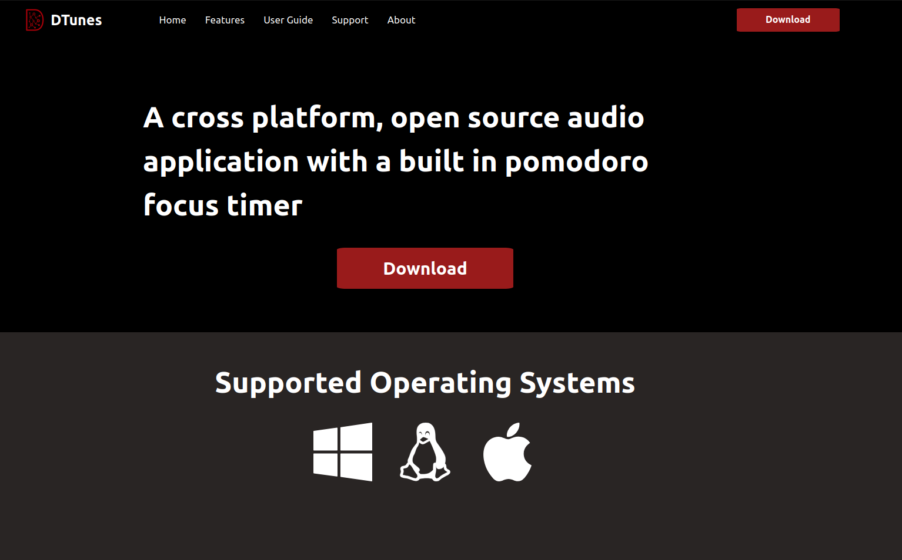

# DTunes

DTunes (stands for decentralized tunes) is an audio application with a built in pomodoro timer. Similar to applications like spotify & soundcloud, DTunes lets you listen to your own audio files, categorize by playlist, artist and genre, and listen to audio in the background. This is a an early iteration of the project and the vision for this software is something that lets you add your own audio, categorize it and then allow the application to generate music that helps you focus for pomodoro sessions. 

# Features

These are the features that comes with DTunes as of `01/11/2024`. This is always subject to change as the project is still very new and evolving. 

## Audio Storage & Categorization

DTunes does not store users audio files centrally, every user has their own database that allows them to categorize audio files on their application. Users can categorize audio by playlist, genre and artist. 

## Background Audio Playing

Manually playing audio is not ideal, to be competitive, DTunes needed to offer background audio playing/queuing. Users will always have files playing in the background weather they select songs for an artist or genre, or wheather users just want to listen to all their audio files. 

## Built In Pomodoro Timer

The hypothesis that DTunes aims to prove is that music can aid with focus. DTunes comes with a built in pomodoro timer to improve focus for users who are passionate about deep or focused work and are proponents of the [Pomodoro Technique](https://en.wikipedia.org/wiki/Pomodoro_Technique). The timer allows you to create focus durations, short and long breaks. 

