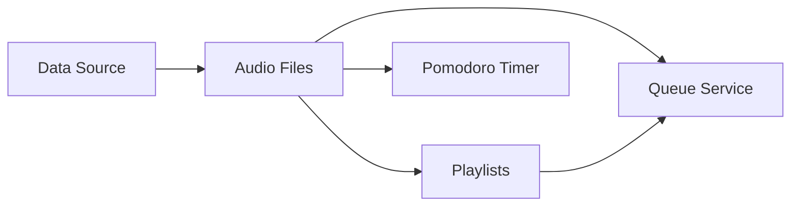

# DTunes

* Process centered around storing, migrating and transforming raw audio file data
* Apply music theory concepts to audio data
* Categorizing audio data with playlists, genres and artists
* Real time background audio player
* A simple and intuitive terminal command line interface for interacting with audio database
* Eventually develop a native user interface using project Fluorite

# Table of Contents

* [Database Design](Projects/DTunes/Design/Database%20Schema.md)
* [Audio Files](Projects/DTunes/Design/Audio%20File.md)
* [Playlist](Projects/DTunes/Design/Playlist.md)
* [Queue](Projects/DTunes/Design/Queue.md)
* [Pomodoro Timer](Projects/DTunes/Design/Pomodoro.md)

# Design

* Abstractions around external data sources that provide audio files
* Utilities needed for working with audio files and playlist collections
* Use queues for temporarily storing songs with continuous playback
* Integrated pomodoro timer for aiding deep work/focus

```mermaid
flowchart LR

A[Data Source] --> B[Audio Files]
B[Audio Files] --> D[Queue Service]
B[Audio Files] --> C[Playlists]
B[Audio Files] --> E[Pomodoro Timer]
C[Playlists] --> D[Queue Service]
```

# Architecture

* Data source produces audio files
* Audio files can be used to configure a pomodoro timer or create playlists
* Files can be queued from a collection of audio files or existing playlists

# Tech Stack

* Rust - Programming Language
	* Database Storage
	* File ingestion and processing
	* Audio data pipelines
	* Command line application utilities
* Native UI Library
	* Will be build on a custom native UI library
	* This is a long term goal

# Design Thinking Questions

* What types of processing can you do on audio file?
* How do we generate audio based on other samples?
* Can we make the process of ingesting audio from any source as SMOOTH as possible?
* Is there a niche in learning about algorithms 