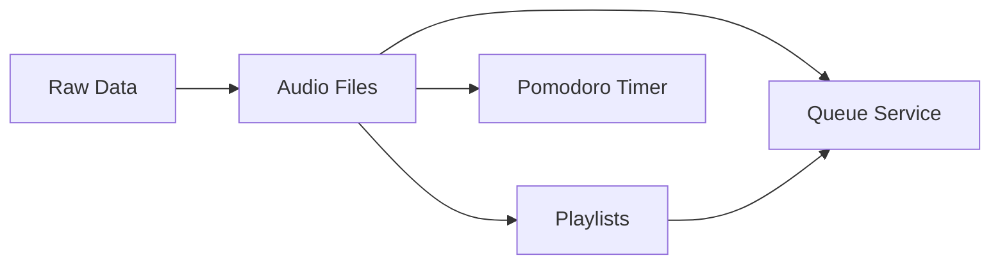

# DTunes

* [Purpose](#Purpose)
* [Architecture](Projects/DTunes/Design/Database%20Schema.md)
* [Tech Stack](#Tech%20Stack)
* [Installation and Setup](#Installation%20and%20Seup)
* [User Guide](#User%20Guide)
	* [Raw Data](#Raw%20Data)
	* [Audio Files](#Audio%20Files)
	* [Playlists](#Playlists)
	

# Purpose 

* Process centered around storing, migrating and transforming raw audio file data
* Categorizing audio data with playlists, genres and artists
* Real time background audio player
* A simple and intuitive terminal command line interface for interacting with audio database
* Apply music theory algorithms
* Eventually develop a native user interface using project Fluorite

# Architecture

* Raw data stored in folders and then ingested to database
* Utilities needed for working with audio files and playlist collections
* Use queues for temporarily storing songs with continuous playback
* Integrated pomodoro timer for aiding deep work/focus


```mermaid
flowchart LR

A[Raw Data] --> B[Audio Files]
B[Audio Files] --> D[Queue Service]
B[Audio Files] --> C[Playlists]
B[Audio Files] --> E[Pomodoro Timer]
C[Playlists] --> D[Queue Service]
```
## Design Consensus

* Data source produces audio files
* Audio files can be used to configure a pomodoro timer or create playlists
* Files can be queued from a collection of audio files or existing playlists

# Tech Stack

* Rust - Programming Language
	* Database Storage
	* File ingestion and processing
	* Audio data pipelines
	* Command line application utilities
* Native UI Library
	* Will be build on a custom native UI library
	* This is a long term goal

# Installation and Setup

1. Clone the repository

```
git clone https://github.com/shaysingh818/DTunes.git
```

2. Install the rust programming language: https://www.rust-lang.org/tools/install
3. Build the source code

```
cargo build
```

4. Run the unit tests (optional)

```
cargo test
```

5. Binary file is located in : `target/debug/./dtunes`
6. To confirm if install worked, run `./dtunes --help`

# User Guide

* User guide on how to use the binary for DTunes
* All functionalities can be used through the CLI
* To invoke DTunes, try the following: `./dtunes --help`

```
dtunes 0.1.0
Shay Singh
🎵 Simple command line audio player with built in pomodoro timer

USAGE:
    dtunes <SUBCOMMAND>

OPTIONS:
    -h, --help       Print help information
    -V, --version    Print version information

SUBCOMMANDS:
    audio-file    
    help          Print this message or the help of the given subcommand(s)
    playlist      Work with playlists on DTunes

```
## Raw Data

* The  `data` directory contains folders for storing and exporting audio files
* For getting audio data synced to your DTunes instance, follow these steps
	* Drop audio files (wav, mp3) in the `data/raw` directory
	* Command to sync: `./dtunes audio-file sync ../../data/raw ../../data/audio_files`
* To see if the files synced to the db, run this command: `./dtunes audio-file view all`
* Explanation of each directory
	* `data/raw/` - User drops raw audio data here for inserting to database
	* `data/audio_files/` - This is where inserted/valid audio files are stored on the instance
	* `data/transformed/` - Audio file processing/manipulation is stored here
	* `data/unit/` - Unit testing directories, do not touch this!

## Audio Files

* The audio files module is responsible for working with wav and mp3 files
* The audio file module stores the following attributes
	* `file_name` - name of the audio file
	* `file_type` - extension of the file
	* `duration` - duration of how long the file is
	* `sample_rate` - not populated yet
	* `storage_path` - path to where audio file is stored
* To use the audio files module try the following command

```
./dtunes audio-file
```

* Expected output

```
dtunes-audio-file 

USAGE:
    dtunes audio-file <SUBCOMMAND>

OPTIONS:
    -h, --help    Print help information

SUBCOMMANDS:
    help     Print this message or the help of the given subcommand(s)
    queue    
    sync     Sync Audio sources from config file
    view     View sources in DTunes database
```
