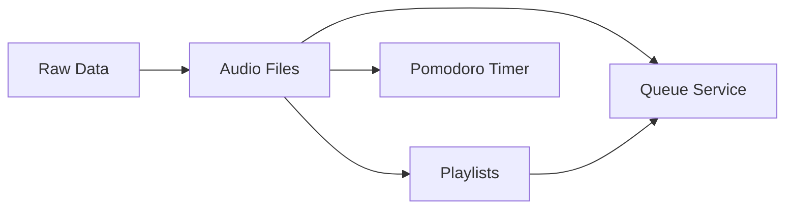

# DTunes

* [Purpose](#Purpose)
* [Architecture](Projects/DTunes/Design/Database%20Schema.md)
* [Tech Stack](#Tech%20Stack)
* [Installation and Setup](#Installation%20and%20Seup)
* [User Guide](#User%20Guide)

# Purpose 

* Process centered around storing, migrating and transforming raw audio file data
* Apply music theory concepts to audio data
* Categorizing audio data with playlists, genres and artists
* Real time background audio player
* A simple and intuitive terminal command line interface for interacting with audio database
* Eventually develop a native user interface using project Fluorite

# Architecture

* Raw data stored in folders and then ingested to database
* Utilities needed for working with audio files and playlist collections
* Use queues for temporarily storing songs with continuous playback
* Integrated pomodoro timer for aiding deep work/focus


```mermaid
flowchart LR

A[Raw Data] --> B[Audio Files]
B[Audio Files] --> D[Queue Service]
B[Audio Files] --> C[Playlists]
B[Audio Files] --> E[Pomodoro Timer]
C[Playlists] --> D[Queue Service]
```
## Design Consensus

* Data source produces audio files
* Audio files can be used to configure a pomodoro timer or create playlists
* Files can be queued from a collection of audio files or existing playlists

# Tech Stack

* Rust - Programming Language
	* Database Storage
	* File ingestion and processing
	* Audio data pipelines
	* Command line application utilities
* Native UI Library
	* Will be build on a custom native UI library
	* This is a long term goal

# Installation and Setup

1. Clone the repository

```
git clone https://github.com/shaysingh818/DTunes.git
```

2. Install the rust programming language: https://www.rust-lang.org/tools/install
3. Build the source code

```
cargo build
```

4. Run the unit tests (optional)

```
cargo test
```

5. Binary file is located in : `target/debug/./dtunes`
6. To confirm if install worked, run `./dtunes --help`

# Design Thinking Questions

* What types of processing can you do on audio file?
* How do we generate audio based on other samples?
* Can we make the process of ingesting audio from any source as SMOOTH as possible?
* Is there a niche in learning about algorithms 